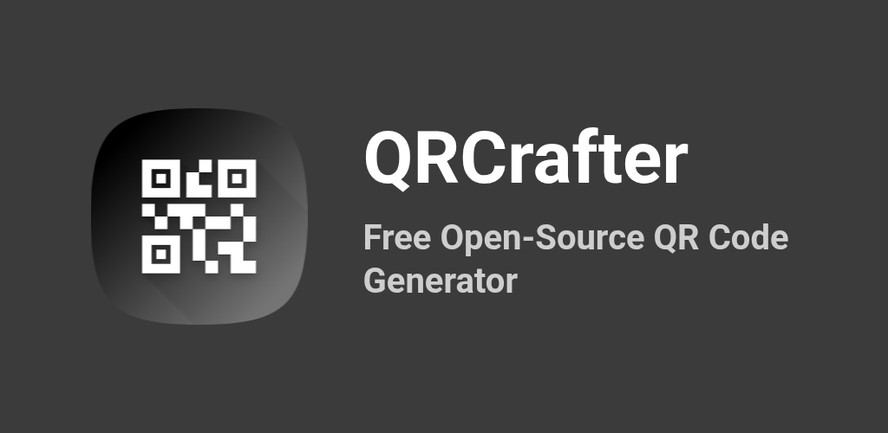
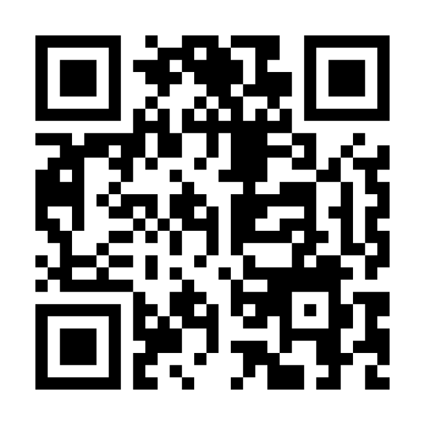
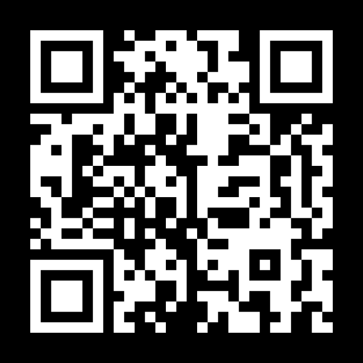

# QRCrafter



|  |  |
|---|---|
| Light Mode | Dark Mode |

**Free & Open Source QR Code Generator & Decoder** — no proxies, no tracking, no paywalls. Your data never leaves your device.

Available as:
- **React Native app** (Android/iOS)
- **Web app** (Next.js) in the `/web` directory

## Why?

Most QR code generators online:
- Create proxy URLs (like bit.ly) instead of direct QR codes
- Require payment for basic features
- Track your data

This app generates and decodes **real QR codes** locally on your device. What you type is exactly what gets encoded. Period.

## Features

### Create QR Codes
- **Multiple QR types**: URL, Plain Text, Wi-Fi, Email, Phone, SMS
- **Instant preview**: QR code updates in real-time as you type
- **Color customization**: Pick foreground & background colors
- **Adjustable size**: Slider to control QR code dimensions
- **Share & Save**: Export as PNG image

### Decode QR Codes
- **Upload from gallery**: Select QR code images from your device
- **Paste from clipboard**: Decode copied images, image URLs, or base64 image data
- **Load from URL**: Decode QR codes from any image URL
- **Copy decoded data**: One-tap copy to clipboard
- **Open URLs**: Direct link opening for decoded URLs

### General
- **Dark mode**: Automatic system theme support
- **100% offline**: All processing happens on-device
- **Privacy first**: No data ever leaves your device

## Getting Started

### Downloads

#### Pre-built Releases
Pre-built binaries are available in the [releases](releases/) directory:
- **Windows**: `.msi` (installer) or `.exe` (portable)  
- **Linux**: `.AppImage`, `.deb`, or `.rpm`  
- **Android**: `.apk` or `.aab` (Google Play)

No installation required for `.AppImage` or `.exe` — just download and run.

#### Verify Downloaded Files
Each release includes a `checksums-*.txt` file. Verify integrity:

**Windows**:
```powershell
# PowerShell
(Get-FileHash "QRCrafter-v1.3.0-windows.exe" -Algorithm SHA256).Hash
# Compare with the hash in checksums-windows.txt
```

**Linux**:
```bash
sha256sum QRCrafter-v1.3.0-linux.AppImage
# Compare with the hash in checksums-linux.txt
```

**macOS**:
```bash
shasum -a 256 QRCrafter-v1.3.0-macos.dmg
# Compare with the hash in checksums-macos.txt
```

### Prerequisites

#### All Platforms
- **Node.js** >= 22.11.0 ([download](https://nodejs.org/))

#### Windows (Desktop Build)
- **Rust** 1.77.2+ ([download rustup](https://rustup.rs/))
  - Download `rustup-init.exe` and run it
  - Choose option 1 (default install)
  - **Important**: Restart your terminal or PC after installation for PATH to update
- **Git** ([download](https://git-scm.com/))

#### macOS (Desktop Build)
- **Rust** 1.77.2+ (`curl --proto '=https' --tlsv1.2 -sSf https://sh.rustup.rs | sh`)
- **Xcode Command Line Tools** (`xcode-select --install`)
- **Git** (included with Xcode)

#### Linux (Desktop Build)
- **Rust** 1.77.2+ ([instructions](https://rustup.rs/))
- **Build essentials**: `sudo apt-get install build-essential libssl-dev pkg-config libgtk-3-dev libayatana-appindicator3-dev`
- **Git**

#### Android
- **Android Studio** ([download](https://developer.android.com/studio))
- **Android SDK** (set `ANDROID_HOME` environment variable)
- **JDK** 11+ (Usually installed with Android Studio)

#### iOS
- **Xcode** (via App Store)
- **CocoaPods** (`sudo gem install cocoapods`)

### Install & Run

#### Development Setup
```bash
# Clone and install dependencies
git clone https://github.com/yourusername/QRCrafter.git
cd QRCrafter
npm install
```

#### Run on Android
```bash
npm run android
```

#### Run on iOS
```bash
cd ios && pod install && cd ..
npm run ios
```

#### Run Web Version (Next.js)
```bash
cd web
npm install
npm run dev
# Open http://localhost:3000
```

#### Build Desktop Version (Tauri)
```bash
cd web
npm run tauri:build
```

### Troubleshooting

#### Windows: Rust/Cargo Not Found
If you get "rustc is not recognized" or "cargo is not recognized":

1. **Check if Rust is installed**:
   ```powershell
   ls $env:USERPROFILE\.cargo\bin
   ```
   If this folder doesn't exist, install Rust from https://rustup.rs/

2. **Update PATH in current session**:
   ```powershell
   $env:PATH += ";$env:USERPROFILE\.cargo\bin"
   rustc --version  # Should show version
   cargo --version
   ```

3. **Permanently add to PATH** (recommended):
   - Press `Win + X` and search "Environment Variables"
   - Click "Edit the system environment variables"
   - Click "Environment Variables..."
   - Under "User variables", find or create `Path`
   - Click "Edit..." and add: `C:\Users\YourUsername\.cargo\bin`
   - Click OK and restart your terminal/IDE

#### Linux: Build Fails or Missing Dependencies
If you get errors about missing `openssl`, `gtk`, or other libraries:

```bash
# Debian/Ubuntu
sudo apt-get update
sudo apt-get install build-essential libssl-dev pkg-config libgtk-3-dev libayatana-appindicator3-dev

# Fedora
sudo dnf install gcc glibc-devel openssl-devel pkg-config gtk3-devel libayatana-appindicator-devel
```

Then try building again:
```bash
cd web
npm run tauri:build
```

#### iOS: Pod Install Fails
```bash
cd ios
rm Podfile.lock
pod install
cd ..
```

#### Android: Gradle Build Fails
Make sure `ANDROID_HOME` is set:
```bash
# macOS/Linux (add to ~/.bashrc or ~/.zshrc)
export ANDROID_HOME=$HOME/Library/Android/sdk
export PATH=$PATH:$ANDROID_HOME/emulator:$ANDROID_HOME/tools:...

# Windows (PowerShell)
$env:ANDROID_HOME = "C:\Users\YourUsername\AppData\Local\Android\sdk"
```

## Tech Stack

### React Native (Mobile)
- React Native 0.84
- TypeScript
- `react-native-qrcode-svg` — QR code rendering
- `react-native-svg` — SVG support
- `react-native-view-shot` — Screenshot capture for Android
- `react-native-share` — Native share sheet
- `react-native-wifi-reborn` — Wi-Fi QR code support
- `@react-native-camera-roll/camera-roll` — Save to gallery
- `react-native-safe-area-context` — Safe area handling
- `@react-native-community/slider` — Size control
- `react-native-image-picker` — Image selection from gallery
- `@react-native-clipboard/clipboard` — Clipboard access
- `react-native-fs` — File system operations
- `jsqr` — Pure JavaScript QR decoding
- `jimp` — Image processing for QR decoding

### Web (see `/web/README.md` for details)
- Next.js 14
- TypeScript
- Tailwind CSS
- `react-qr-code` — QR generation
- `jsqr` — QR decoding

## Project Structure

```
src/
├── components/
│   ├── QrTypeSelector.tsx    # QR type picker chips
│   ├── QrInputForm.tsx       # Dynamic input forms per type
│   └── QrCustomizer.tsx      # Color & size controls
├── screens/
│   ├── HomeScreen.tsx        # QR code creation screen
│   └── DecoderScreen.tsx     # QR code decoding screen
├── theme/
│   ├── colors.ts             # Color palette & presets
│   └── useAppTheme.ts        # Dark/light theme hook
├── types/
│   └── qr.ts                 # TypeScript types & constants
└── utils/
    └── encoders.ts           # QR data encoders (Wi-Fi, email, etc.)

shared/
├── qr.ts                     # Shared QR types/constants for mobile + web
└── encoders.ts               # Shared encoder helpers for mobile + web
```

## License

MIT — do whatever you want with it.
